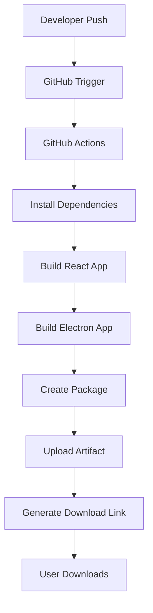

# 📦 Git Artifacts y CI/CD - Guía Completa

## 🎯 ¿Qué son los Git Artifacts?

Los **Git Artifacts** son archivos o paquetes generados durante el proceso de construcción (build) de tu proyecto que se almacenan temporalmente en la plataforma de control de versiones (GitHub, GitLab, etc.). Estos archivos representan el resultado compilado, empaquetado o procesado de tu código fuente.

### Características Principales:

- 🕐 **Temporales**: Se almacenan por un tiempo limitado (30-90 días)
- 🔗 **Vinculados**: Cada artifact se asocia a un commit específico
- 📥 **Descargables**: Disponibles mediante enlaces directos
- 🔄 **Automáticos**: Se generan automáticamente en cada build
- 📊 **Versionados**: Cada build produce artifacts únicos

## 🔄 Flujo de Artifacts en QA Generator



### Proceso Detallado:

1. **Trigger (Disparador)**:

   - Push a rama `main` o `develop`
   - Pull Request creado
   - Tag de versión creado

2. **Build Process**:

   - Checkout del código
   - Setup del entorno Node.js
   - Instalación de dependencias
   - Compilación de React
   - Empaquetado con Electron

3. **Artifact Creation**:

   - Generación del ejecutable
   - Creación del paquete de distribución
   - Compresión y optimización

4. **Upload & Storage**:
   - Subida a GitHub Artifacts
   - Generación de enlace de descarga
   - Notificación de disponibilidad

## 🚀 Implementación en QA Generator

### 1. Configuración del Workflow

Crea el archivo `.github/workflows/build-and-release.yml`:

```yaml
name: 🚀 Build and Release QA Generator

on:
  push:
    branches: [main, develop]
    paths-ignore:
      - "**.md"
      - ".gitignore"
  pull_request:
    branches: [main]
  release:
    types: [created]

env:
  NODE_VERSION: "18"
  ARTIFACT_RETENTION_DAYS: 30

jobs:
  build:
    name: 🔨 Build Application
    runs-on: windows-latest

    steps:
      - name: 📥 Checkout Repository
        uses: actions/checkout@v4
        with:
          fetch-depth: 0

      - name: 🔧 Setup Node.js
        uses: actions/setup-node@v4
        with:
          node-version: ${{ env.NODE_VERSION }}
          cache: "npm"

      - name: 📦 Install Dependencies
        run: |
          npm ci
          npm run postinstall || true

      - name: 🏗️ Build React Application
        run: |
          npm run build
          echo "✅ React build completed"

      - name: 🖥️ Build Electron Application
        run: |
          npm run dist
          echo "✅ Electron build completed"

      - name: 📋 List Build Output
        run: |
          echo "📁 Build artifacts:"
          dir dist-electron

      - name: 📦 Create Release Package
        run: |
          mkdir QA_Generator_Release
          copy "dist-electron\\QA Generator-1.0.0.exe" "QA_Generator_Release\\"
          copy "GUIA_USUARIO.md" "QA_Generator_Release\\"
          copy "Iniciar_QA_Generator.bat" "QA_Generator_Release\\"
          echo "🚀 QA Generator v1.0.0" > QA_Generator_Release\\VERSION.txt
          echo "📅 Build Date: %DATE% %TIME%" >> QA_Generator_Release\\VERSION.txt
          echo "📝 Commit: ${{ github.sha }}" >> QA_Generator_Release\\VERSION.txt
          echo "🌿 Branch: ${{ github.ref_name }}" >> QA_Generator_Release\\VERSION.txt

      - name: 📤 Upload Build Artifacts
        uses: actions/upload-artifact@v4
        with:
          name: QA-Generator-${{ github.run_number }}-${{ github.sha }}
          path: QA_Generator_Release/
          retention-days: ${{ env.ARTIFACT_RETENTION_DAYS }}
          if-no-files-found: error

      - name: 🗜️ Create Compressed Archive
        run: |
          powershell Compress-Archive -Path "QA_Generator_Release\\*" -DestinationPath "QA-Generator-v1.0.0-build-${{ github.run_number }}.zip"

      - name: 📤 Upload ZIP Artifact
        uses: actions/upload-artifact@v4
        with:
          name: QA-Generator-ZIP-${{ github.run_number }}
          path: QA-Generator-v1.0.0-build-${{ github.run_number }}.zip
          retention-days: ${{ env.ARTIFACT_RETENTION_DAYS }}

  release:
    name: 🏷️ Create Release
    if: startsWith(github.ref, 'refs/tags/v')
    needs: build
    runs-on: windows-latest

    steps:
      - name: 📥 Checkout Repository
        uses: actions/checkout@v4

      - name: 📥 Download Build Artifacts
        uses: actions/download-artifact@v4
        with:
          name: QA-Generator-ZIP-${{ github.run_number }}

      - name: 🏷️ Create GitHub Release
        uses: softprops/action-gh-release@v1
        with:
          files: QA-Generator-v1.0.0-build-${{ github.run_number }}.zip
          name: QA Generator ${{ github.ref_name }}
          body: |
            ## 🚀 QA Generator ${{ github.ref_name }}

            ### 📦 Instalación
            1. Descarga el archivo ZIP
            2. Extrae en tu carpeta preferida
            3. Ejecuta `Iniciar_QA_Generator.bat`

            ### ✨ Características
            - ✅ Generación automática de casos de prueba
            - ✅ Múltiples formatos de exportación
            - ✅ Integración con Azure DevOps
            - ✅ Interfaz moderna y responsive

            ### 🔧 Requisitos
            - Windows 10/11
            - 50MB de espacio libre

            ### 📝 Changelog
            Ver commits incluidos en este release para detalles de cambios.

            ### 🆘 Soporte
            Para reportar problemas, usa el sistema de Issues de GitHub.
          draft: false
          prerelease: false
          generate_release_notes: true
        env:
          GITHUB_TOKEN: ${{ secrets.GITHUB_TOKEN }}
```

### 2. Configuración del Proyecto

Actualiza el `package.json` para optimizar el proceso de build:

```json
{
  "scripts": {
    "postinstall": "electron-builder install-app-deps",
    "prebuild": "npm run clean",
    "build": "tsc -b && vite build",
    "predist": "npm run build",
    "dist": "electron-builder --win --config.compression=maximum",
    "clean": "rimraf dist dist-electron electron-cache node_modules/.cache"
  },
  "build": {
    "publish": null,
    "buildDependenciesFromSource": false,
    "nodeGypRebuild": false,
    "npmRebuild": false,
    "artifactName": "${productName}-${version}.${ext}",
    "compression": "maximum",
    "removePackageScripts": true,
    "files": ["dist/**/*", "main.js", "package.json", "!node_modules"]
  }
}
```

## 🔗 Acceso a Artifacts

### Desde GitHub Interface:

1. **Ir al repositorio** en GitHub
2. **Hacer clic en "Actions"** en la barra superior
3. **Seleccionar el workflow run** deseado
4. **Scroll hacia abajo** hasta "Artifacts"
5. **Hacer clic en el artifact** para descargar

### Desde GitHub CLI:

```bash
# Listar artifacts del último run
gh run list --limit 1

# Descargar artifact específico
gh run download [run-id] --name QA-Generator-ZIP-123

# Descargar todos los artifacts del último run
gh run download
```

### Desde API REST:

```bash
# Listar artifacts
curl -H "Authorization: token YOUR_TOKEN" \
  https://api.github.com/repos/OWNER/REPO/actions/artifacts

# Descargar artifact
curl -L -H "Authorization: token YOUR_TOKEN" \
  https://api.github.com/repos/OWNER/REPO/actions/artifacts/ARTIFACT_ID/zip \
  -o artifact.zip
```

## 📊 Ventajas de los Artifacts

### Para Desarrollo:

- ✅ **Builds consistentes**: Mismo entorno siempre
- ✅ **Historial completo**: Todos los builds guardados
- ✅ **Testing automático**: Pruebas en cada build
- ✅ **Rollback fácil**: Acceso a versiones anteriores

### Para QA:

- ✅ **Acceso inmediato**: Builds disponibles al instante
- ✅ **Trazabilidad**: Cada build vinculado a cambios
- ✅ **Paralelo**: Testing sin esperar releases
- ✅ **Automatización**: Menos trabajo manual

### Para Distribución:

- ✅ **Enlaces directos**: Compartir fácilmente
- ✅ **Versionado**: Control de releases
- ✅ **Seguridad**: Acceso controlado
- ✅ **Almacenamiento**: Sin ocupar espacio local

## 🎯 Casos de Uso Específicos

### 1. Testing Continuo

```yaml
- name: 🧪 Run Tests
  run: |
    npm run test
    npm run test:e2e

- name: 📊 Upload Test Results
  uses: actions/upload-artifact@v4
  with:
    name: test-results-${{ github.run_number }}
    path: test-results/
```

### 2. Múltiples Plataformas

```yaml
strategy:
  matrix:
    os: [windows-latest, macos-latest, ubuntu-latest]

- name: 🔨 Build for ${{ matrix.os }}
  run: npm run dist

- name: 📤 Upload ${{ matrix.os }} Build
  uses: actions/upload-artifact@v4
  with:
    name: build-${{ matrix.os }}-${{ github.run_number }}
    path: dist-electron/
```

### 3. Documentación Automática

```yaml
- name: 📚 Generate Documentation
  run: npm run docs:generate

- name: 📤 Upload Documentation
  uses: actions/upload-artifact@v4
  with:
    name: documentation-${{ github.run_number }}
    path: docs/
```

## 🛠️ Mejores Prácticas

### 1. Naming Convention

```yaml
# ✅ Bueno: Descriptivo y versionado
name: QA-Generator-v1.0.0-build-${{ github.run_number }}

# ❌ Malo: Genérico
name: build
```

### 2. Retention Policy

```yaml
# ✅ Bueno: Tiempo específico según necesidad
retention-days: 30  # Para builds de desarrollo
retention-days: 90  # Para releases importantes
```

### 3. Conditional Uploads

```yaml
# ✅ Solo subir si el build es exitoso
- name: 📤 Upload Artifacts
  if: success()
  uses: actions/upload-artifact@v4
```

### 4. Size Optimization

```yaml
# ✅ Comprimir antes de subir
- name: 🗜️ Compress Artifacts
  run: |
    tar -czf build.tar.gz dist-electron/

- name: 📤 Upload Compressed
  uses: actions/upload-artifact@v4
  with:
    name: build-compressed
    path: build.tar.gz
```

## 🚨 Troubleshooting

### Problemas Comunes:

1. **Artifact no se genera**:

   ```yaml
   # Verificar que el path existe
   - name: 📋 List Build Output
     run: ls -la dist-electron/
   ```

2. **Artifact muy grande**:

   ```yaml
   # Excluir archivos innecesarios
   - name: 🧹 Clean Build
     run: |
       rm -rf dist-electron/node_modules
       rm -rf dist-electron/*.map
   ```

3. **Permisos insuficientes**:
   ```yaml
   # Verificar permisos del token
   permissions:
     contents: read
     actions: write
   ```

## 📈 Monitoreo y Métricas

### GitHub Actions Dashboard:

- **Success Rate**: Porcentaje de builds exitosos
- **Build Time**: Tiempo promedio de construcción
- **Artifact Size**: Tamaño de los artifacts generados
- **Download Stats**: Frecuencia de descarga

### Alertas Automáticas:

```yaml
- name: 🚨 Notify on Failure
  if: failure()
  uses: actions/github-script@v6
  with:
    script: |
      github.rest.issues.createComment({
        issue_number: context.issue.number,
        owner: context.repo.owner,
        repo: context.repo.repo,
        body: '🚨 Build failed! Check the logs for details.'
      })
```

## 🎉 Conclusión

Los Git Artifacts transforman tu flujo de desarrollo al proporcionar:

- **Automatización completa** del proceso de build
- **Distribución inmediata** de nuevas versiones
- **Trazabilidad total** de cambios y builds
- **Integración perfecta** con herramientas de CI/CD

Con esta configuración, cada push a tu repositorio generará automáticamente un ejecutable listo para descargar, optimizando el proceso de testing y distribución del QA Generator.

---

**📅 Última actualización**: Julio 2025  
**🔗 Recursos adicionales**: [GitHub Actions Documentation](https://docs.github.com/actions)
