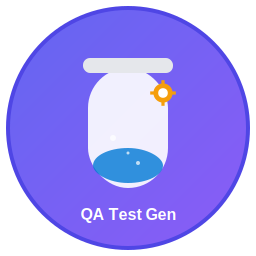

# 🚀 QA Generator

<div align="center">
  
  
  **Una aplicación de escritorio para generar casos de prueba automáticamente**
  
  [](https://github.com/ElDaiko/atomatic-test-cases/actions)
  [](https://github.com/ElDaiko/atomatic-test-cases/releases)
  [](LICENSE)
  [](https://github.com/ElDaiko/atomatic-test-cases/releases)
  [](https://github.com/ElDaiko/atomatic-test-cases/actions/workflows/build.yml)
</div>

## 🎯 Descarga Rápida - Builds Automáticos

<div align="center">

### 📦 Última Versión Disponible

| Plataforma     | Descarga Directa                                                                                                                                                       | Estado                                                                                                                                 |
| -------------- | ---------------------------------------------------------------------------------------------------------------------------------------------------------------------- | -------------------------------------------------------------------------------------------------------------------------------------- |
| 🖥️ **Windows** | [](https://github.com/ElDaiko/atomatic-test-cases/actions/workflows/build.yml) | [](https://github.com/ElDaiko/atomatic-test-cases/actions) |
| 🍎 **macOS**   | [](https://github.com/ElDaiko/atomatic-test-cases/actions/workflows/build.yml)      | [](https://github.com/ElDaiko/atomatic-test-cases/actions)   |
| 🐧 **Linux**   | [](https://github.com/ElDaiko/atomatic-test-cases/actions/workflows/build.yml)     | [](https://github.com/ElDaiko/atomatic-test-cases/actions)   |

### 🚀 Acceso Inmediato a Builds

> **💡 Tip**: Cada push a `main` genera automáticamente nuevos executables. ¡Siempre tienes la última versión disponible!

**📥 Cómo descargar:**

1. Haz clic en el botón de descarga de tu plataforma arriba
2. Ve a la sección "Artifacts" en la página de Actions
3. Descarga el archivo correspondiente a tu sistema operativo
4. ¡Listo! Ejecuta y usa la aplicación

[🔗 **Ver todos los builds disponibles**](https://github.com/ElDaiko/atomatic-test-cases/actions/workflows/build.yml)

</div>

---

## ✨ Características

- 🤖 **Generación automática** de casos de prueba a partir de historias de usuario
- � **Formato Gherkin** para casos de prueba estructurados
- 📄 **Múltiples formatos** de exportación (TXT, CSV, XML, JSON)
- 🔗 **Integración Azure DevOps** para work items automáticos
- � **Interfaz moderna** y fácil de usar
- ⚡ **Rendimiento optimizado** con Electron + React + TypeScript
- 🖥️ **Multiplataforma** - Windows, macOS, Linux

## 🎯 ¿Para quién es?

- **QA Engineers** que quieren automatizar la creación de casos de prueba
- **Product Owners** que necesitan documentar criterios de aceptación
- **Equipos Ágiles** que buscan optimizar su proceso de testing
- **Desarrolladores** que quieren mejorar la calidad de sus entregas

## 🚀 Inicio Rápido

### 📥 Descarga Rápida (Recomendado)

1. Ve a [Releases](https://github.com/ElDaiko/atomatic-test-cases/releases)
2. Descarga la última versión para tu sistema operativo
3. Extrae el archivo ZIP
4. Ejecuta `Iniciar_QA_Generator.bat` (Windows)

### 🛠️ Desarrollo Local

```bash
# Clonar el repositorio
git clone https://github.com/ElDaiko/atomatic-test-cases.git
cd qa-generator

# Instalar dependencias
npm install

# Ejecutar en modo desarrollo
npm run electron-dev

# Generar ejecutable
npm run dist
```

## 📖 Cómo usar

### 1. 📝 Crear Historia de Usuario

```
Como usuario, quiero poder iniciar sesión en el sistema
para acceder a mi cuenta personal
```

### 2. ✅ Agregar Criterios de Aceptación

```
- El usuario debe poder ingresar email y contraseña
- El sistema debe validar las credenciales
- El usuario debe ser redirigido al dashboard
- Se debe mostrar un mensaje de error si las credenciales son incorrectas
```

### 3. 🎯 Generar Casos de Prueba

La aplicación generará automáticamente casos como:

```gherkin
Scenario: Validación de credenciales correctas
  Given que el usuario está en la página de login
  When el usuario ingresa credenciales válidas
  Then el sistema debe autenticar al usuario
  And el usuario debe ser redirigido al dashboard
```

### 4. 📤 Exportar Resultados

- **TXT**: Texto plano para documentación
- **CSV**: Para importar en Excel o herramientas de gestión
- **XML**: Formato estructurado para sistemas
- **JSON**: Para APIs y desarrollo
- **Azure DevOps**: Integración directa con work items

## 🔧 Configuración Azure DevOps

Para usar la integración con Azure DevOps:

1. Clic en **"Configurar Azure DevOps"**
2. Completa los campos:
   - **Organización**: `tu-organizacion`
   - **Proyecto**: `tu-proyecto`
   - **Personal Access Token**: Tu PAT con permisos de Work Items
3. Haz clic en **"Exportar a Azure DevOps"**

## 🏗️ Arquitectura del Proyecto

```
qa-generator/
├── 📁 src/                    # Código fuente React
│   ├── 📁 components/         # Componentes UI
│   ├── 📁 utils/             # Lógica de negocio
│   └── 📁 types/             # Tipos TypeScript
├── 📁 dist-electron/         # Builds de Electron
├── 📄 main.js               # Proceso principal Electron
├── 📄 package.json          # Configuración del proyecto
└── 📄 vite.config.ts        # Configuración Vite
```

### Stack Tecnológico

- **Frontend**: React 19 + TypeScript
- **Desktop**: Electron 37
- **Build**: Vite 7 + Electron Builder
- **Styling**: CSS Modules
- **Testing**: Formato Gherkin

## 📦 Scripts Disponibles

```bash
# Desarrollo
npm run dev                 # Servidor de desarrollo
npm run electron-dev        # Desarrollo con Electron

# Producción
npm run build              # Build de React
npm run dist               # Generar ejecutable optimizado
npm run dist-win           # Build para Windows
npm run dist-mac           # Build para macOS
npm run dist-linux         # Build para Linux

# Utilidades
npm run clean              # Limpiar cache
npm run lint               # Linting de código
npm run preview            # Preview del build
```

## 🔄 CI/CD con GitHub Actions

El proyecto incluye automatización completa con GitHub Actions:

- ✅ **Build automático** en cada push
- ✅ **Artifacts generados** para descarga inmediata
- ✅ **Releases automáticos** con tags
- ✅ **Múltiples plataformas** soportadas

Ver [GIT_ARTIFACTS_GUIA.md](GIT_ARTIFACTS_GUIA.md) para más detalles.

## 📦 Artifacts y Distribución Automática

### 🎯 ¿Qué son los Artifacts?

Los **Artifacts** son los archivos ejecutables que se generan automáticamente cada vez que se hace un push al repositorio. Esto significa que **siempre tienes acceso a la última versión** sin esperar releases oficiales.

### 📥 Cómo Acceder a los Artifacts

#### Método 1: Acceso Directo

1. Ve a [GitHub Actions](https://github.com/ElDaiko/atomatic-test-cases/actions/workflows/build.yml)
2. Haz clic en el **último workflow exitoso** (con ✅)
3. Scroll hacia abajo hasta la sección **"Artifacts"**
4. Descarga el artifact para tu plataforma:
   - `Windows-qa-automatization`
   - `macOS-qa-automatization`
   - `Linux-qa-automatization`

#### Método 2: Enlaces Directos

- **Windows**: [🔗 Último build Windows](https://github.com/ElDaiko/atomatic-test-cases/actions/workflows/build.yml)
- **macOS**: [🔗 Último build macOS](https://github.com/ElDaiko/atomatic-test-cases/actions/workflows/build.yml)
- **Linux**: [🔗 Último build Linux](https://github.com/ElDaiko/atomatic-test-cases/actions/workflows/build.yml)

### 🚀 Ventajas de los Artifacts

| Ventaja           | Descripción                              |
| ----------------- | ---------------------------------------- |
| **🔄 Automático** | Cada push genera nuevos executables      |
| **⚡ Inmediato**  | Disponible 5-10 minutos después del push |
| **🎯 Específico** | Vinculado a commits específicos          |
| **📊 Trazable**   | Historial completo de builds             |
| **🔒 Seguro**     | Solo usuarios con acceso al repo         |

### 📋 Información de Builds

Cada artifact incluye:

- **Executable** principal para la plataforma
- **GUIA_USUARIO.md** con instrucciones
- **VERSION.txt** con información del build:
  - Número de build
  - Commit SHA
  - Fecha de construcción
  - Plataforma objetivo

### 🕐 Retención de Artifacts

- **Tiempo de vida**: 30 días
- **Límite de storage**: Configurable en GitHub
- **Limpieza automática**: Los artifacts antiguos se eliminan automáticamente

### 🎪 Ejemplo de Uso

```bash
# Scenario: Desarrollador hizo un fix
git commit -m "Fix: Corregir exportación CSV"
git push origin main

# 5 minutos después...
# ✅ Nuevo artifact disponible con el fix
# 📥 QA puede descargar y probar inmediatamente
```

## 📊 Características Técnicas

### Generación de Casos de Prueba

- **Algoritmo de NLP básico** para análisis de texto
- **Patrones de detección** para diferentes tipos de criterios
- **Generación automática** de pasos Gherkin
- **Casos de prueba comunes** incluidos automáticamente

### Optimizaciones

- **Compresión máxima** en builds
- **Lazy loading** de componentes
- **Tree shaking** para bundle mínimo
- **Portable executable** sin instalación

## 🤝 Contribuir

¡Las contribuciones son bienvenidas!

1. Fork el proyecto
2. Crea una feature branch (`git checkout -b feature/amazing-feature`)
3. Commit tus cambios (`git commit -m 'Add amazing feature'`)
4. Push a la branch (`git push origin feature/amazing-feature`)
5. Abre un Pull Request

## 📋 Roadmap

- [ ] **v1.1**: Integración con Jira
- [ ] **v1.2**: Plantillas personalizables
- [ ] **v1.3**: Exportación a TestRail
- [ ] **v1.4**: Integración con Confluence
- [ ] **v1.5**: API REST para integración

## 🐛 Reportar Problemas

### 📋 Antes de Reportar

1. **Verifica la documentación**: Consulta [GUIA_USUARIO.md](GUIA_USUARIO.md) y [DOCUMENTACION_TECNICA.md](DOCUMENTACION_TECNICA.md)
2. **Prueba la última versión**: Descarga el artifact más reciente
3. **Revisa problemas conocidos**: Consulta la sección de troubleshooting

### 🚀 Tipos de Issues

#### 🐛 Bug Report

**Plantilla para reportar bugs:**

```
## 🐛 Descripción del Bug
[Descripción clara y concisa del problema]

## 🔄 Pasos para Reproducir
1. Ir a...
2. Hacer clic en...
3. Observar error...

## 📋 Comportamiento Esperado
[Qué debería pasar]

## 📋 Comportamiento Actual
[Qué está pasando]

## 🖥️ Información del Sistema
- OS: [Windows 10/11, macOS, Linux]
- Versión de QA Generator: [1.0.0]
- Build Number: [del archivo VERSION.txt]

## 📎 Capturas de Pantalla
[Si aplica, adjunta capturas]
```

#### ✨ Feature Request

**Plantilla para solicitar features:**

```
## ✨ Descripción del Feature
[Descripción clara de la funcionalidad deseada]

## 🎯 Problema que Resuelve
[Qué problema específico resuelve]

## 💡 Propuesta de Solución
[Cómo crees que debería implementarse]

## 📋 Casos de Uso
[Ejemplos de cómo se usaría]
```

#### 🔧 Soporte Técnico

**Para problemas de instalación o configuración:**

```
## 🔧 Problema de Soporte
[Describe el problema técnico]

## 🖥️ Configuración
- Sistema Operativo:
- Versión de Node.js:
- Método de instalación: [Artifact/Build local]

## 📋 Logs/Errores
[Copia cualquier mensaje de error]
```

### 📞 Contacto de Soporte

- **Email**: miguel.roldan@pragma.com.co
- **Equipo**: Pragma - Área de QA
- **Respuesta**: 24-48 horas hábiles

## 📚 Documentación

- 📖 [Guía de Usuario](GUIA_USUARIO.md) - Instrucciones de uso
- 🔧 [Documentación Técnica](DOCUMENTACION_TECNICA.md) - Detalles de implementación
- 📦 [Git Artifacts Guide](GIT_ARTIFACTS_GUIA.md) - CI/CD y automatización
- 🎯 [Guía de Artifacts](ARTIFACTS_GUIA.md) - **Cómo descargar y usar artifacts**

## 🏆 Créditos

- **Autor**: Miguel Roldan
- **Organización**: Pragma
- **Año**: 2025

## 📜 Licencia

Este proyecto está bajo la licencia MIT. Ver [LICENSE](LICENSE) para más detalles.

---

<div align="center">
  
  **¿Te gusta el proyecto? ¡Dale una ⭐!**
  
  [� Contacto](mailto:miguel.roldan@pragma.com.co) · 
  [📖 Documentación](DOCUMENTACION_TECNICA.md) · 
  [🎯 Guía de Artifacts](ARTIFACTS_GUIA.md) ·
  [📦 Descargar Latest](https://github.com/ElDaiko/atomatic-test-cases/actions/workflows/build.yml)
  
</div>

---

**Versión**: 1.0.0  
**Desarrollado por**: Miguel Roldan - Pragma  
**Fecha**: Julio 2025
